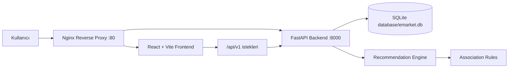
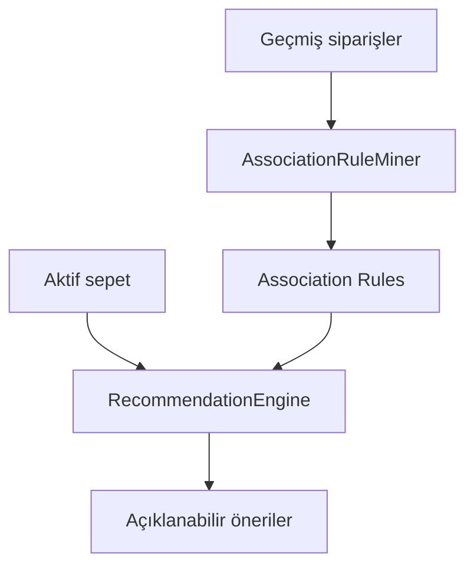
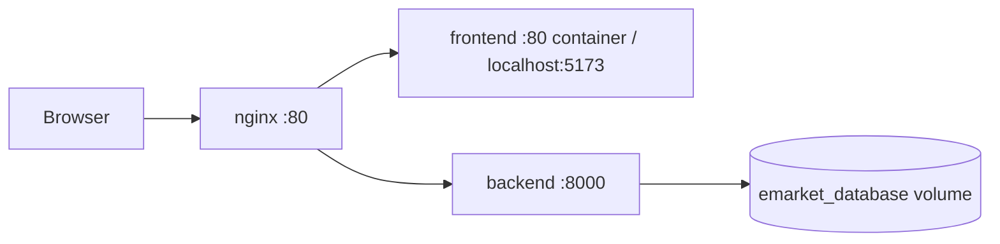

# E-Market Smart Basket


E-Market Smart Basket, sepet içeriğine göre açıklanabilir ürün önerileri sunan modern bir e-ticaret demo uygulamasıdır. Proje; FastAPI tabanlı backend, React + Vite tabanlı frontend, SQLite veritabanı, Apriori/association rule mantığıyla çalışan öneri sistemi, admin dashboard, sipariş akışı, test altyapısı ve Docker production mimarisi içerir.

Amaç; küçük ve anlaşılır bir e-market senaryosu üzerinden ürün listeleme, sepet yönetimi, sipariş oluşturma, geçmiş siparişleri görüntüleme, öneri üretme ve admin analitiklerini tek bir uçtan uca uygulamada göstermektir.

## İçindekiler

- [Özellikler](#özellikler)
- [Kullanılan Teknolojiler](#kullanılan-teknolojiler)
- [Sistem Mimarisi](#sistem-mimarisi)
- [Kurulum](#kurulum)
- [Docker ile Çalıştırma](#docker-ile-çalıştırma)
- [API Endpointleri](#api-endpointleri)
- [Ekran Görüntüleri](#ekran-görüntüleri)
- [Klasör Yapısı](#klasör-yapısı)
- [Recommendation Sistemi](#recommendation-sistemi)
- [Docker Mimarisi](#docker-mimarisi)
- [Testler](#testler)
- [Ortam Değişkenleri](#ortam-değişkenleri)
- [Katkı Sağlama](#katkı-sağlama)
- [Lisans](#lisans)

## Özellikler

- Ürün katalog listeleme
- Kategori filtreleme ve ürün arama
- Responsive ve modern alışveriş arayüzü
- LocalStorage destekli kalıcı sepet yönetimi
- Ürün miktarı artırma, azaltma ve sepet temizleme
- Sipariş oluşturma
- Sipariş geçmişi ve sipariş detayı görüntüleme
- Sepete göre dinamik ürün önerileri
- Öneriler için support, confidence ve lift metrikleri
- Admin giriş sistemi
- Admin dashboard kartları ve grafik alanları
- Association rule tablosu ve güçlü kural gösterimleri
- Merkezi hata yönetimi ve logging altyapısı
- Backend ve frontend testleri
- Docker Compose ile production benzeri çalışma ortamı
- Nginx reverse proxy ile tek giriş noktası

## Kullanılan Teknolojiler

### Backend

- Python 3.12
- FastAPI
- Uvicorn
- Pydantic
- SQLite
- Pandas
- pytest
- httpx
- python-dotenv
- pwdlib[argon2]

### Frontend

- React 18
- Vite
- React Router
- Vitest
- jsdom
- CSS Modules yerine mevcut global CSS yaklaşımı
- LocalStorage

### DevOps ve Altyapı

- Docker
- Docker Compose
- Nginx
- GitHub Actions
- SQLite volume persistence

## Sistem Mimarisi

Uygulama üç ana katmandan oluşur:

1. Frontend, kullanıcı arayüzünü ve sepet deneyimini yönetir.
2. Backend, REST API, sipariş yönetimi, admin oturumu, analitikler ve öneri sistemini sağlar.
3. SQLite, ürünleri, siparişleri, admin oturumlarını ve association rule kayıtlarını saklar.



## Kurulum

Aşağıdaki adımlar Docker kullanmadan yerel geliştirme ortamı içindir.

### 1. Repository'yi klonlayın

```bash
git clone <repository-url>
cd e-market_smart_basket
```

### 2. Backend kurulumu

```bash
cd backend
python -m venv venv
```

Windows PowerShell:

```powershell
.\venv\Scripts\Activate.ps1
```

macOS/Linux:

```bash
source venv/bin/activate
```

Bağımlılıkları yükleyin:

```bash
pip install -r requirements.txt
pip install -r requirements-dev.txt
```

Backend'i çalıştırın:

```bash
uvicorn main:app --reload --host 127.0.0.1 --port 8000
```

Backend varsayılan adresi:

```text
http://127.0.0.1:8000
```

Swagger dokümantasyonu:

```text
http://127.0.0.1:8000/docs
```

### 3. Frontend kurulumu

Yeni terminalde:

```bash
cd frontend
npm ci
npm run dev
```

Frontend varsayılan adresi:

```text
http://localhost:5173
```

## Docker ile Çalıştırma

Production benzeri ortamı tek komutla başlatmak için:

```bash
docker compose up --build
```

Servisler:

| Servis | Açıklama | Port |
| --- | --- | --- |
| backend | FastAPI API servisi | 8000 |
| frontend | React build çıktısını servis eden Nginx | 5173 |
| nginx | Reverse proxy ve tek giriş noktası | 80 |

Uygulama reverse proxy üzerinden:

```text
http://localhost
```

Backend healthcheck:

```text
http://localhost/api/v1/health
```

Containerları durdurmak için:

```bash
docker compose down
```

Veritabanı verileri Docker volume üzerinde korunur. Volume'u da silmek isterseniz:

```bash
docker compose down -v
```

> Not: `docker compose down -v` SQLite verilerini de siler.

## API Endpointleri

Ana API prefix'i:

```text
/api/v1
```

### Sistem

| Method | Endpoint | Açıklama |
| --- | --- | --- |
| GET | `/` | API bilgi yanıtı |
| GET | `/api/v1/health` | Backend ve veritabanı sağlık kontrolü |

### Ürünler

| Method | Endpoint | Açıklama |
| --- | --- | --- |
| GET | `/api/v1/products` | Tüm ürünleri listeler |
| GET | `/api/v1/products?category=<kategori>` | Kategoriye göre ürün listeler |
| GET | `/api/v1/products?search=<metin>` | Ürün adı veya kategori içinde arama yapar |
| GET | `/api/v1/products/{product_id}` | Ürün detayını getirir |
| GET | `/api/v1/categories` | Kategori listesini getirir |

### Siparişler

| Method | Endpoint | Açıklama |
| --- | --- | --- |
| GET | `/api/v1/orders?user_id=<id>` | Kullanıcının sipariş geçmişini getirir |
| GET | `/api/v1/orders/{order_id}?user_id=<id>` | Sipariş detayını getirir |
| POST | `/api/v1/orders` | Yeni sipariş oluşturur |

Örnek sipariş isteği:

```json
{
  "user_id": 1,
  "items": [
    {
      "product_id": 1,
      "quantity": 2
    }
  ]
}
```

### Öneriler

| Method | Endpoint | Açıklama |
| --- | --- | --- |
| POST | `/api/v1/recommendations` | Sepetteki ürünlere göre öneri üretir |

Örnek öneri isteği:

```json
{
  "basket_product_ids": [1, 3],
  "limit": 5
}
```

### Admin Auth

| Method | Endpoint | Açıklama |
| --- | --- | --- |
| POST | `/api/v1/auth/admin/login` | Admin girişi yapar |
| GET | `/api/v1/auth/admin/me` | Aktif admin oturumunu döndürür |
| POST | `/api/v1/auth/admin/logout` | Admin oturumunu kapatır |

### Admin Analytics

Bu endpointler admin oturumu gerektirir.

| Method | Endpoint | Açıklama |
| --- | --- | --- |
| GET | `/api/v1/admin/analytics/dashboard` | Dashboard özetini, grafik verilerini ve güçlü kuralları döndürür |
| GET | `/api/v1/admin/analytics/summary` | Dashboard kart metriklerini döndürür |
| GET | `/api/v1/admin/analytics/top-products` | En çok satan ürünleri döndürür |
| GET | `/api/v1/admin/analytics/categories` | Kategori bazlı satış dağılımını döndürür |
| GET | `/api/v1/admin/analytics/daily-sales` | Günlük satış verilerini döndürür |
| GET | `/api/v1/admin/analytics/rules` | En güçlü association rule kayıtlarını döndürür |
| POST | `/api/v1/admin/rules/rebuild` | Association rule kayıtlarını yeniden üretir |

## Ekran Görüntüleri

Aşağıdaki görseller repository'ye eklendiğinde README içinde doğrudan görüntülenebilir.

### Ana sayfa

```text
docs/screenshots/home.png
```


### Sepet ve öneriler

```text
docs/screenshots/cart-recommendations.png
```


### Admin dashboard

```text
docs/screenshots/admin-dashboard.png
```


### Mobil görünüm

```text
docs/screenshots/mobile.png
```


> Görseller henüz eklenmediyse bu alanlar placeholder olarak kalır. Açık kaynak yayınında `docs/screenshots` klasörü oluşturup ekran görüntülerini buraya ekleyebilirsiniz.

## Klasör Yapısı

```text
e-market_smart_basket/
├── .github/
│   └── workflows/
│       └── tests.yml
├── backend/
│   ├── database/
│   │   └── emarket.db
│   ├── src/
│   │   ├── api.py
│   │   ├── analytics_repository.py
│   │   ├── analytics_service.py
│   │   ├── auth_dependencies.py
│   │   ├── auth_repository.py
│   │   ├── auth_service.py
│   │   ├── db_helper.py
│   │   ├── engine.py
│   │   ├── exception_handlers.py
│   │   ├── logging_config.py
│   │   ├── order_service.py
│   │   ├── repository.py
│   │   ├── rule_miner.py
│   │   ├── schemas.py
│   │   ├── settings.py
│   │   └── validation.py
│   ├── tests/
│   ├── Dockerfile
│   ├── Dockerfile.test
│   ├── main.py
│   ├── pytest.ini
│   ├── requirements.txt
│   └── requirements-dev.txt
├── frontend/
│   ├── src/
│   │   ├── components/
│   │   ├── config/
│   │   ├── context/
│   │   ├── hooks/
│   │   ├── pages/
│   │   ├── services/
│   │   ├── styles/
│   │   ├── utils/
│   │   ├── App.jsx
│   │   └── main.jsx
│   ├── Dockerfile
│   ├── Dockerfile.test
│   ├── default.conf
│   ├── package.json
│   └── vite.config.js
├── nginx/
│   └── default.conf
├── docker-compose.yml
├── docker-compose.test.yml
├── .env.production.example
└── README.md
```

## Recommendation Sistemi

E-Market Smart Basket öneri sistemi, geçmiş siparişlerden association rule çıkararak çalışır. Kullanıcının sepetindeki ürünler antecedent olarak değerlendirilir ve bu ürünlerle birlikte sık satın alınan consequent ürünler önerilir.

Sistem üç temel metriği kullanıcı dostu şekilde sunar:

| Metrik | Anlamı |
| --- | --- |
| Support | İlgili ürün kombinasyonunun tüm siparişler içinde ne kadar sık görüldüğünü gösterir |
| Confidence | Sepetteki ürünü alan kullanıcıların önerilen ürünü de alma olasılığını gösterir |
| Lift | İki ürünün birlikte alınmasının rastgele birliktelikten ne kadar güçlü olduğunu gösterir |

Örnek açıklama:

```text
Süt alan kullanıcıların %84'ü Ekmek de satın aldı.
Support: %22 · Confidence: %84 · Lift: 1.36
```

Backend tarafında association rule üretimi `AssociationRuleMiner` ile yapılır. Öneri üretimi `RecommendationEngine` tarafından gerçekleştirilir. Sipariş oluşturulduktan sonra kural yenileme işlemi arka planda planlanır.

Algoritma akışı:



## Docker Mimarisi

Docker Compose üç servis tanımlar:

### backend

- `backend/Dockerfile` ile Python slim image üzerinden build edilir.
- FastAPI uygulamasını Uvicorn ile `0.0.0.0:8000` üzerinde başlatır.
- `/api/v1/health` endpointi ile healthcheck yapılır.
- SQLite veritabanı `/app/database` dizinine bağlı volume üzerinde tutulur.

### frontend

- `frontend/Dockerfile` iki aşamalı build kullanır.
- İlk aşamada Node image ile React uygulaması build edilir.
- İkinci aşamada build çıktısı Nginx image içine kopyalanır.
- Container içinde `/api/` istekleri backend servisine proxy edilir.

### nginx

- `nginx/default.conf` reverse proxy görevi görür.
- `/api/` isteklerini backend servisine gönderir.
- `/` isteklerini frontend servisine gönderir.
- Kullanıcı için ana giriş noktası `http://localhost` adresidir.



## Testler

### Backend testleri

```bash
cd backend
pytest
```

### Frontend testleri

```bash
cd frontend
npm test
```

### Frontend production build

```bash
cd frontend
npm run build
```

### Docker test ortamı

```bash
docker compose -f docker-compose.test.yml up --build --abort-on-container-exit
```

## Ortam Değişkenleri

Örnek environment dosyaları:

```text
backend/.env.example
frontend/.env.example
.env.production.example
```

Gerçek `.env` dosyaları repository'ye eklenmemelidir.

Öne çıkan değişkenler:

| Değişken | Açıklama |
| --- | --- |
| `VITE_API_BASE_URL` | Frontend API base URL değeri. Docker için varsayılan: `/api/v1` |
| `EMARKET_ENV` | Backend çalışma ortamı |
| `EMARKET_ALLOWED_ORIGINS` | CORS izinli origin listesi |
| `EMARKET_SESSION_TTL_MINUTES` | Admin oturum süresi |
| `EMARKET_COOKIE_SECURE` | Cookie secure ayarı |
| `EMARKET_LOG_LEVEL` | Backend log seviyesi |

## Katkı Sağlama

Katkılar memnuniyetle kabul edilir. Profesyonel ve sürdürülebilir bir akış için önerilen süreç:

1. Repository'yi fork edin.
2. Yeni bir branch oluşturun.

```bash
git checkout -b feature/kisa-aciklama
```

3. Değişikliklerinizi küçük ve anlaşılır commitlerle yapın.
4. Backend ve frontend testlerini çalıştırın.
5. Gerekirse Docker build/test akışını doğrulayın.
6. Pull request açın.

Pull request açmadan önce kontrol listesi:

- Mevcut endpoint davranışları bozulmadı.
- Backend testleri başarılı.
- Frontend testleri başarılı.
- Frontend build başarılı.
- Yeni environment değeri eklendiyse `.env.example` dosyaları güncellendi.
- UI değişikliği varsa ekran görüntüsü eklendi.

## Kod Standartları

- Backend tarafında servis, repository ve schema ayrımı korunmalıdır.
- Frontend tarafında component, hook, service ve util ayrımı korunmalıdır.
- Magic string ve magic number kullanımı mümkün olduğunca config/constants altında toplanmalıdır.
- API yanıtları kullanıcı dostu hata mesajlarıyla ele alınmalıdır.
- Recommendation algoritmasının davranışı değiştirilmeden sunum katmanı geliştirilebilir.

## Lisans

Bu proje açık kaynak olarak yayınlanmaya uygundur. Önerilen lisans MIT License'tır.

Açık kaynak dağıtıma çıkmadan önce repository köküne `LICENSE` dosyası ekleyerek lisans metnini netleştirmeniz önerilir.

---

E-Market Smart Basket; modern frontend deneyimi, açıklanabilir öneri sistemi ve FastAPI tabanlı sade backend mimarisiyle öğrenme, geliştirme ve portföy sunumu için hazırlanmış uçtan uca bir e-ticaret demo projesidir.
