# E-Market Smart Basket


E-Market Smart Basket; geçmiş siparişlerden association rule üreterek kullanıcının sepetine açıklanabilir ürün önerileri sunan, önerilerin gösterimden satın almaya kadar etkisini ölçen, FastAPI ve React tabanlı uçtan uca bir e-ticaret demo uygulamasıdır.

Proje; ürün katalogu, kalıcı sepet, sipariş akışı, dinamik öneriler, admin analitik paneli, association rule yönetimi, CSV/XLSX export, test altyapısı ve Docker Compose + Nginx ile production-benzeri çalışma ortamını aynı mimaride birleştirir.

## İçindekiler

- [Özellikler](#özellikler)
- [Kullanılan Teknolojiler](#kullanılan-teknolojiler)
- [Sistem Mimarisi](#sistem-mimarisi)
- [Kurulum](#kurulum)
- [Docker ile Çalıştırma](#docker-ile-çalıştırma)
- [API Endpointleri](#api-endpointleri)
- [Recommendation Sistemi](#recommendation-sistemi)
- [Admin Analitikleri ve Rule Yönetimi](#admin-analitikleri-ve-rule-yönetimi)
- [Ekran Görüntüleri](#ekran-görüntüleri)
- [Klasör Yapısı](#klasör-yapısı)
- [Testler](#testler)
- [Ortam Değişkenleri](#ortam-değişkenleri)
- [Docker Mimarisi](#docker-mimarisi)
- [Katkı Sağlama](#katkı-sağlama)
- [Lisans](#lisans)

## Özellikler

### Kullanıcı tarafı

- Ürün listeleme, ürün arama ve kategori filtreleme
- Responsive alışveriş arayüzü
- LocalStorage destekli kalıcı sepet yönetimi
- Ürün miktarı artırma, azaltma ve sepet temizleme
- Sepetten sipariş oluşturma
- Sipariş geçmişi ve sipariş detayı görüntüleme
- Sepet içeriğine göre dinamik ürün önerileri
- Önerilerin support, confidence, lift ve toplam skor değerleriyle açıklanması
- Öneri kartından sepete ekleme ve öneri etkisi takibi

### Öneri etkisi takibi

- Öneri gösterimlerinin event bazlı kaydedilmesi
- Öneri kartından sepete ekleme olaylarının kaydedilmesi
- Önerilerin başarılı siparişe dönüşümünün takip edilmesi
- Öneri kaynaklı cironun hesaplanması
- Gösterim, sepete ekleme oranı, satın alma oranı ve öneri kaynaklı ciro metrikleri

### Admin tarafı

- Admin giriş, oturum ve CSRF korumalı yönetim akışı
- Global dönem filtresi: bugün, son 7 gün, son 30 gün, tüm zamanlar ve özel tarih aralığı
- Seçili dönemin önceki eşit dönemle karşılaştırılması
- Sipariş, ciro, ortalama sepet tutarı, satılan ürün ve rule özetleri
- Günlük ortalama sipariş ve günlük ortalama ciro
- Günlük satış grafikleri
- En çok satan ürünler
- En çok birlikte satılan ürün çiftleri
- Kategori bazlı ciro
- Güçlü association rule analizi
- Recommendation impact performans takibi

### Association rule yönetimi

- Kural listeleme
- Arama
- Aktif/pasif filtreleme
- Support, confidence ve lift filtreleri
- Created date ve updated date filtreleri
- Confidence, lift, support, created date, updated date ve calculation count sıralaması
- Server-side pagination
- Kural detayını görüntüleme
- CSV ve XLSX dışa aktarma
- Association rule kayıtlarını yeniden üretme

### Genel altyapı

- Merkezi hata yönetimi ve standart HTTP hata yanıtları
- Backend logging altyapısı
- Backend ve frontend testleri
- Docker Compose ile backend, frontend ve reverse proxy servisleri
- Nginx reverse proxy ile `/api/` isteklerinin backend'e yönlendirilmesi
- SQLite verileri için Docker volume persistence

## Kullanılan Teknolojiler

### Backend

- Python
- FastAPI
- Uvicorn
- Pydantic
- SQLite
- Pandas
- pwdlib[argon2]
- python-dotenv
- pytest
- httpx

### Frontend

- React 18
- Vite
- React Router
- Vitest
- jsdom
- LocalStorage
- Global CSS tabanlı mevcut stil yapısı

### DevOps ve altyapı

- Docker
- Docker Compose
- Nginx
- GitHub Actions
- SQLite named volume

## Sistem Mimarisi

Uygulama üç ana katmandan oluşur:

1. Frontend, kullanıcı arayüzünü, sepet deneyimini, sipariş akışını ve admin ekranlarını yönetir.
2. Backend, REST API, admin auth, sipariş yönetimi, analitikler, recommendation event kayıtları ve association rule tabanlı öneri sistemini sağlar.
3. SQLite, ürünleri, siparişleri, admin oturumlarını, recommendation event kayıtlarını ve association rule geçmişini saklar.

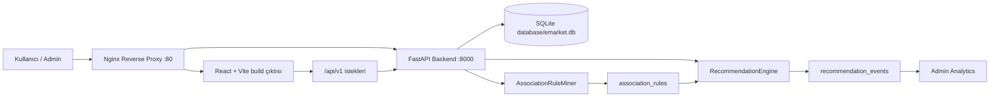

## Kurulum

Aşağıdaki adımlar Docker kullanmadan yerel geliştirme ortamı içindir.

### 1. Repository'yi klonlayın

```bash
git clone https://github.com/UmranAKKURT/emarket-smart-basket.git
cd emarket-smart-basket
```

### 2. Backend kurulumu

```bash
cd backend
python -m venv venv
```

Windows PowerShell:

```powershell
.\venv\Scripts\Activate.ps1
```

macOS/Linux:

```bash
source venv/bin/activate
```

Bağımlılıkları yükleyin:

```bash
pip install -r requirements.txt
pip install -r requirements-dev.txt
```

Backend'i çalıştırın:

```bash
uvicorn main:app --reload --host 127.0.0.1 --port 8000
```

Backend varsayılan adresi:

```text
http://127.0.0.1:8000
```

Swagger dokümantasyonu:

```text
http://127.0.0.1:8000/docs
```

### 3. Frontend kurulumu

Yeni terminalde:

```bash
cd frontend
npm ci
npm run dev
```

Frontend varsayılan adresi:

```text
http://localhost:5173
```

## Docker ile Çalıştırma

Docker Compose ve Nginx ile production-benzeri çalışma ortamını başlatmak için:

```bash
docker compose up --build
```

Servisler:

| Servis | Açıklama | Port |
| --- | --- | --- |
| backend | FastAPI API servisi | 8000 |
| frontend | React build çıktısını servis eden Nginx | 5173 |
| nginx | Reverse proxy ve tek giriş noktası | 80 |

Reverse proxy üzerinden ana uygulama:

```text
http://localhost
```

Backend healthcheck:

```text
http://localhost/api/v1/health
```

Containerları durdurmak için:

```bash
docker compose down
```

Docker Compose içinde SQLite dosyası `/app/database` yoluna bağlanan `emarket_database` named volume ile korunur. Volume'u da silmek isterseniz:

```bash
docker compose down -v
```

> `docker compose down -v` komutu SQLite verilerini de siler.

## API Endpointleri

Ana API prefix'i:

```text
/api/v1
```

### Sistem

| Method | Endpoint | Açıklama | Yetki |
| --- | --- | --- | --- |
| GET | `/` | API bilgi yanıtı | Public |
| GET | `/api/v1/health` | Backend ve veritabanı sağlık kontrolü | Public |

### Ürünler

| Method | Endpoint | Açıklama | Yetki |
| --- | --- | --- | --- |
| GET | `/api/v1/products` | Ürünleri listeler; `category`, `search`, `limit`, `offset` parametrelerini destekler | Public |
| GET | `/api/v1/products/{product_id}` | Ürün detayını getirir | Public |
| GET | `/api/v1/categories` | Kategori listesini getirir | Public |

### Siparişler

| Method | Endpoint | Açıklama | Yetki |
| --- | --- | --- | --- |
| GET | `/api/v1/orders?user_id=<id>` | Kullanıcının sipariş geçmişini getirir; `limit` ve `offset` destekler | Public |
| GET | `/api/v1/orders/{order_id}?user_id=<id>` | Sipariş detayını getirir | Public |
| POST | `/api/v1/orders` | Yeni sipariş oluşturur | Public |

Örnek sipariş isteği:

```json
{
  "user_id": 1,
  "items": [
    {
      "product_id": 1,
      "quantity": 2
    }
  ],
  "recommendation_event_keys": [
    "session-123:rule-10:add-to-cart"
  ]
}
```

### Öneriler

| Method | Endpoint | Açıklama | Yetki |
| --- | --- | --- | --- |
| POST | `/api/v1/recommendations` | Sepetteki ürünlere göre ürün önerileri üretir | Public |
| POST | `/api/v1/recommendation-events` | Öneri gösterimi, öneriden sepete ekleme ve satın alma olaylarını kaydeder | Public |

Örnek öneri isteği:

```json
{
  "basket_product_ids": [1, 7],
  "limit": 5
}
```

Örnek recommendation event isteği:

```json
{
  "event_key": "session-123:rule-10:impression",
  "session_id": "session-123",
  "user_id": 1,
  "rule_id": 10,
  "source_product_id": 1,
  "recommended_product_id": 7,
  "event_type": "impression",
  "order_id": null
}
```

### Admin Auth

| Method | Endpoint | Açıklama | Yetki |
| --- | --- | --- | --- |
| POST | `/api/v1/auth/admin/login` | Admin girişi yapar ve session cookie oluşturur | Public |
| GET | `/api/v1/auth/admin/me` | Aktif admin oturumunu doğrular | Admin |
| POST | `/api/v1/auth/admin/logout` | Admin oturumunu kapatır | Admin + CSRF |

### Admin Analytics

| Method | Endpoint | Açıklama | Yetki |
| --- | --- | --- | --- |
| GET | `/api/v1/admin/analytics/dashboard` | Dashboard özetleri, dönem metrikleri, recommendation impact, top ürünler, ürün çiftleri, kategori satışları, günlük satışlar ve güçlü rule listesini döndürür | Admin |
| GET | `/api/v1/admin/analytics/dashboard/stream` | Dashboard verilerini Server-Sent Events ile günceller | Admin |
| GET | `/api/v1/admin/analytics/summary` | Dashboard özet metriklerini döndürür | Admin |
| GET | `/api/v1/admin/analytics/top-products` | En çok satan ürünleri döndürür | Admin |
| GET | `/api/v1/admin/analytics/top-product-pairs` | En çok birlikte satılan ürün çiftlerini döndürür | Admin |
| GET | `/api/v1/admin/analytics/categories` | Kategori bazlı satış ve ciro metriklerini döndürür | Admin |
| GET | `/api/v1/admin/analytics/daily-sales` | Günlük satış verilerini döndürür | Admin |
| GET | `/api/v1/admin/analytics/rules` | Güçlü association rule listesini limitli döndürür | Admin |

`/api/v1/admin/analytics/dashboard` endpoint'i `period=today|last_7_days|last_30_days|all_time|custom`, `start_date`, `end_date`, `days`, `top_product_limit`, `pair_limit` ve `rule_limit` parametrelerini destekler.

### Association Rule Yönetimi

| Method | Endpoint | Açıklama | Yetki |
| --- | --- | --- | --- |
| GET | `/api/v1/admin/analytics/rules/page` | Sayfalı, filtreli ve sıralanabilir association rule listesi | Admin |
| GET | `/api/v1/admin/analytics/rules/detail/{rule_id}` | Tek bir rule detayını döndürür | Admin |
| GET | `/api/v1/admin/analytics/rules/export` | Rule listesini CSV veya XLSX olarak dışa aktarır | Admin |
| POST | `/api/v1/admin/rules/rebuild` | Sipariş geçmişinden association rule kayıtlarını yeniden üretir | Admin + CSRF |

`/api/v1/admin/analytics/rules/page` ve `/api/v1/admin/analytics/rules/export` endpointleri şu parametreleri destekler:

- `limit`, `offset`
- `search`
- `sort_by=confidence|lift|support|created_at|updated_at|calculation_count`
- `sort_direction=asc|desc`
- `status_filter=all|active|passive`
- `min_confidence`, `min_lift`, `min_support`
- `created_from`, `created_to`, `updated_from`, `updated_to`
- export için ek olarak `format=csv|xlsx`

## Recommendation Sistemi

Öneri sistemi klasik bir “top 5 rule göster” yaklaşımı yerine, sepet içeriğini ve aktif association rule kayıtlarını birlikte değerlendirir.

Kodda doğrulanan ana sınıflar:

- `AssociationRuleMiner`: geçmiş siparişlerden ürün birlikteliklerini çıkarır; support, confidence ve lift hesaplar; association rule kayıtlarını oluşturur veya günceller.
- `RecommendationEngine`: kullanıcının sepetindeki ürünlere uygun aktif kuralları bulur, sepette zaten bulunan ürünleri eler, önerileri skorlar ve sıralar.

Association rule üretiminde her ürün çifti için iki yönlü aday kural hesaplanır. Aynı kural yeniden hesaplanırsa veritabanındaki kayıt güncellenir; güncel hesapta oluşmayan eski kurallar geçmişi korumak için silinmek yerine pasiflenir.

Recommendation skoru:

```text
score = 0.45 × confidence + 0.35 × lift + 0.20 × support
```

Çalışma sırası:

1. Geçmiş siparişler okunur.
2. Birlikte alınan ürünler belirlenir.
3. Support, confidence ve lift değerleri hesaplanır.
4. Association rule kayıtları oluşturulur veya güncellenir.
5. Kullanıcının sepetindeki ürünlere bağlı aktif kurallar bulunur.
6. Sepette zaten bulunan ürünler öneri listesinden çıkarılır.
7. Aynı önerilen ürün birden fazla kuraldan gelirse en güçlü kural korunur.
8. Öneriler skorlanır, sıralanır ve limit kadar kullanıcıya gösterilir.
9. Gösterim, öneriden sepete ekleme ve satın alma etkisi recommendation event kayıtlarıyla takip edilir.

### Algoritma akışı

```mermaid
flowchart LR
    Orders["Geçmiş siparişler"] --> Pairs["Ürün birlikteliklerinin hesaplanması"]
    Pairs --> Metrics["Support, confidence ve lift"]
    Metrics --> Rules["Association rule kayıtları"]
    Cart["Kullanıcının sepeti"] --> Match["Sepetteki ürünlere uygun aktif kurallar"]
    Rules --> Match
    Match --> Exclude["Sepette bulunan ürünleri ele"]
    Exclude --> Score["0.45 confidence + 0.35 lift + 0.20 support"]
    Score --> Rank["Önerileri sırala ve limitle"]
    Rank --> UI["Önerileri kullanıcıya göster"]
    UI --> Events["Impression ve add_to_cart eventleri"]
    Events --> Purchase["Sipariş ile purchase dönüşümü ve öneri kaynaklı ciro"]
    Purchase --> Analytics["Admin recommendation impact analitiği"]
```

## Admin Analitikleri ve Rule Yönetimi

Admin paneli, satış performansını ve öneri sisteminin etkisini tek ekranda izlemek için tasarlanmıştır.

Dashboard verileri backend'deki `/api/v1/admin/analytics/dashboard` endpoint'inden gelir. Frontend içinde fake analytics data oluşturulmaz. Dashboard ayrıca `/api/v1/admin/analytics/dashboard/stream` SSE endpoint'i ile sayfa yenilemeden güncel verileri alabilir.

Öne çıkan metrikler:

- Toplam sipariş
- Toplam ciro
- Ortalama sepet tutarı
- Toplam satılan ürün
- Toplam association rule
- Aktif rule sayısı
- Seçili dönem sipariş ve ciro metrikleri
- Önceki eşit dönem karşılaştırmaları
- Recommendation impressions, add-to-cart, purchases ve revenue

Rule yönetimi ekranında arama, filtreleme, sıralama, pagination, detay modalı, CSV export, XLSX export ve rebuild işlemleri backend endpointleri üzerinden yürütülür.

## Ekran Görüntüleri

Uygulamanın kullanıcı alışveriş deneyimi, açıklanabilir öneri sistemi ve yönetim paneli aşağıdaki ekran görüntülerinde gösterilmektedir. Görsellere tıklayarak tam boyutlu hâllerini açabilirsiniz.

### Mağaza ve Sepet Deneyimi

#### Ana Mağaza

[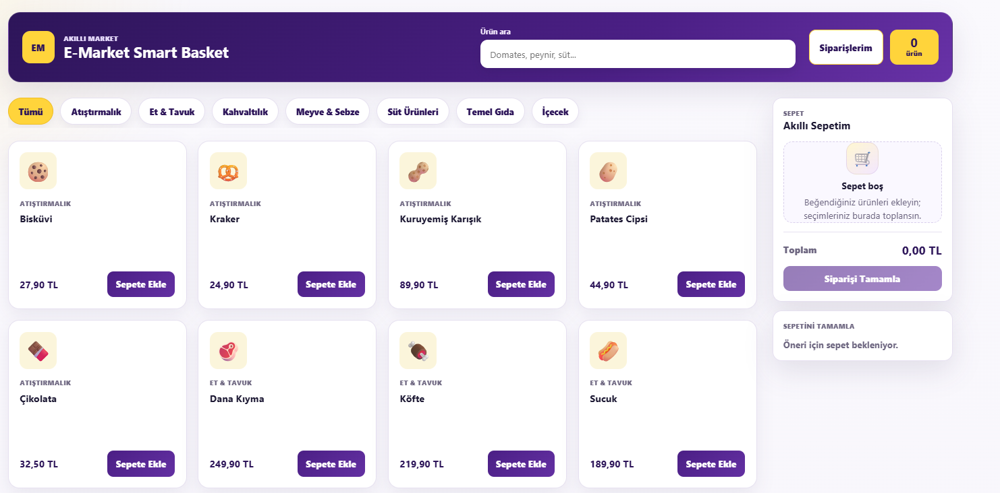](./docs/screenshots/home-desktop.png)

Ürün arama, kategori filtreleri, ürün kartları ve masaüstü sepet alanı.

#### Mobil Sepet ve Açıklanabilir Öneri

[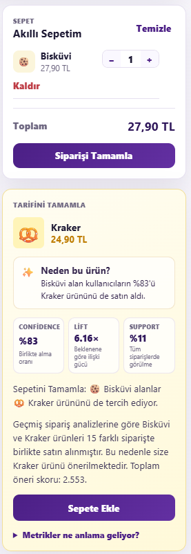](./docs/screenshots/cart-recommendations-mobile.png)

Mobil sepet yönetimi ile confidence, lift ve support metrikleriyle açıklanan ürün önerisi.

### Admin Analitik Paneli

#### Genel Bakış

[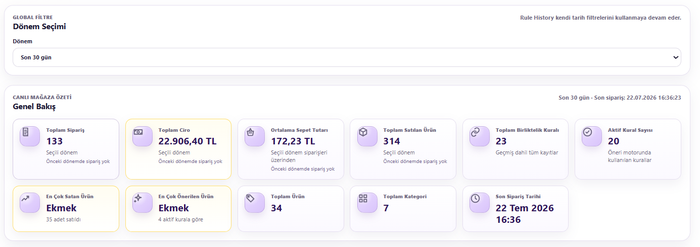](./docs/screenshots/admin-overview.png)

#### Dönem Performansı

[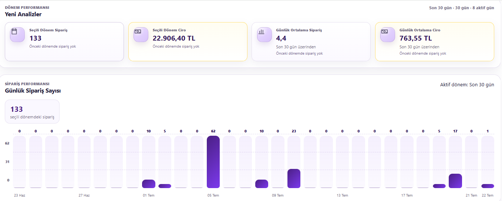](./docs/screenshots/admin-period-performance.png)

#### Ürün ve Sepet İlişkileri

[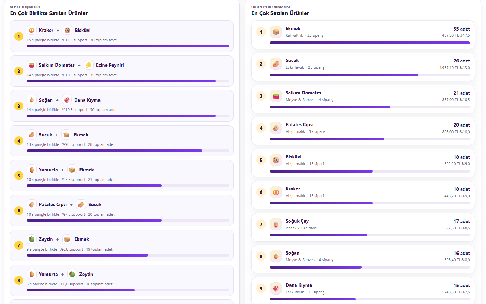](./docs/screenshots/admin-products-and-pairs.png)

#### Kategori Bazında Ciro

[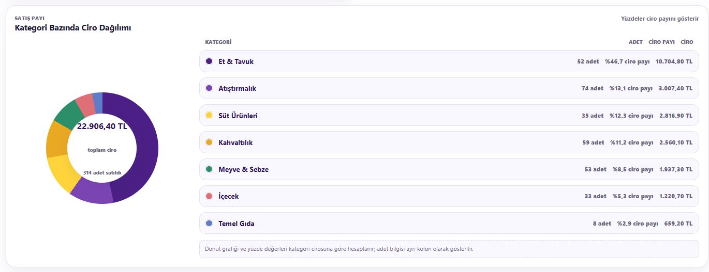](./docs/screenshots/admin-category-revenue.png)

#### Öneri Etkisi

[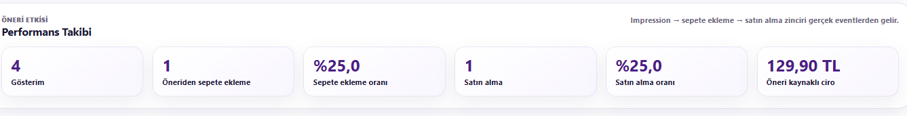](./docs/screenshots/admin-recommendation-impact.png)

Öneri gösterimi, öneriden sepete ekleme, satın alma dönüşümü ve öneri kaynaklı ciro.

### Association Rule Yönetimi

#### Arama, Filtreleme ve Dışa Aktarma

[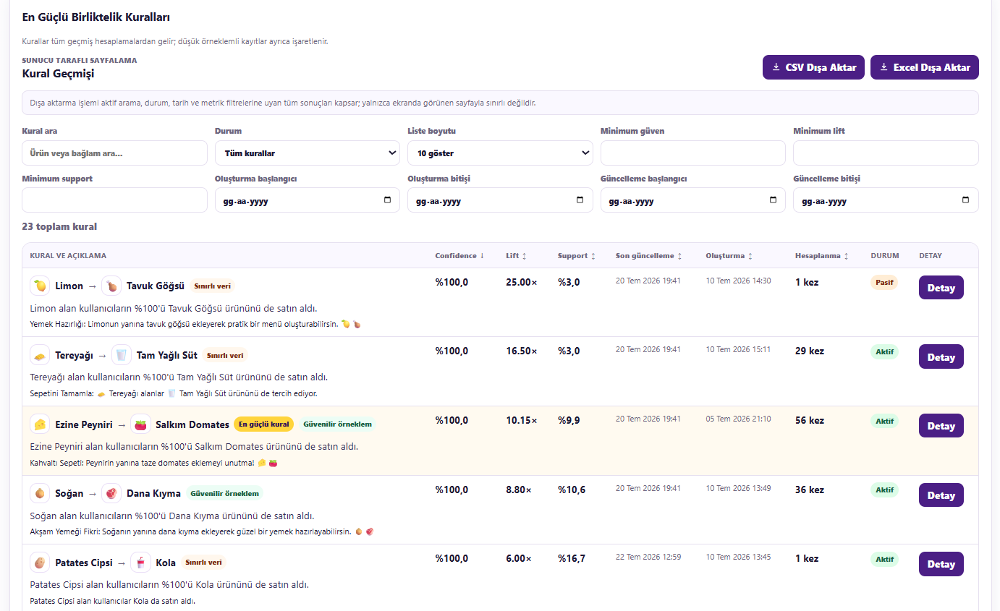](./docs/screenshots/admin-rule-management.png)

#### Kural Geçmişi ve Sayfalama

[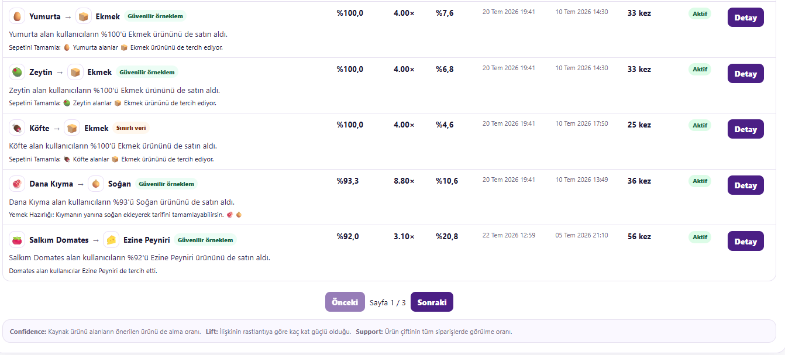](./docs/screenshots/admin-rule-history-pagination.png)

## Klasör Yapısı

```text
.
├── backend/
│   ├── database/
│   ├── src/
│   │   ├── api.py
│   │   ├── analytics_service.py
│   │   ├── auth_service.py
│   │   ├── config.py
│   │   ├── db_helper.py
│   │   ├── engine.py
│   │   ├── exceptions.py
│   │   ├── logging_config.py
│   │   ├── order_service.py
│   │   ├── repository.py
│   │   ├── rule_miner.py
│   │   ├── schemas.py
│   │   └── validation.py
│   ├── tests/
│   ├── Dockerfile
│   ├── Dockerfile.test
│   ├── main.py
│   ├── pytest.ini
│   ├── requirements-dev.txt
│   └── requirements.txt
├── frontend/
│   ├── src/
│   │   ├── components/
│   │   ├── context/
│   │   ├── hooks/
│   │   ├── pages/
│   │   ├── services/
│   │   ├── styles/
│   │   ├── utils/
│   │   ├── App.jsx
│   │   └── main.jsx
│   ├── Dockerfile
│   ├── Dockerfile.test
│   ├── index.html
│   ├── package-lock.json
│   ├── package.json
│   └── vite.config.js
├── docs/
│   └── screenshots/
│       ├── home-desktop.png
│       ├── cart-recommendations-mobile.png
│       ├── admin-overview.png
│       ├── admin-period-performance.png
│       ├── admin-products-and-pairs.png
│       ├── admin-category-revenue.png
│       ├── admin-rule-management.png
│       ├── admin-rule-history-pagination.png
│       └── admin-recommendation-impact.png
├── nginx/
│   └── default.conf
├── .env.production.example
├── docker-compose.test.yml
├── docker-compose.yml
└── README.md
```

> SQLite veritabanı çalışma zamanında `backend/database/` altında bulunur. Docker ortamında bu dizin `emarket_database` named volume ile kalıcı hale getirilir.

## Testler

Backend testleri:

```bash
cd backend
pytest
```

Frontend testleri:

```bash
cd frontend
npm test
```

Frontend production build:

```bash
cd frontend
npm run build
```

Docker test servisleri:

```bash
docker compose -f docker-compose.test.yml up --build --abort-on-container-exit
```

## Ortam Değişkenleri

Örnek ortam dosyaları repository içinde bulunur:

- `backend/.env.example`
- `frontend/.env.example`
- `.env.production.example`

Gerçek `.env` dosyaları git'e eklenmemelidir.

Öne çıkan değişkenler:

| Değişken | Açıklama |
| --- | --- |
| `VITE_API_BASE_URL` | Frontend'in API base path değeri; Docker/Nginx akışında varsayılan `/api/v1` |
| `EMARKET_ENV` | Backend çalışma ortamı |
| `EMARKET_ALLOWED_ORIGINS` | CORS izinli origin listesi |
| `EMARKET_SESSION_TTL_MINUTES` | Admin session süresi |
| `EMARKET_COOKIE_SECURE` | Cookie secure davranışı |
| `EMARKET_LOG_LEVEL` | Backend log seviyesi |

## Docker Mimarisi

Compose dosyasında üç servis bulunur:

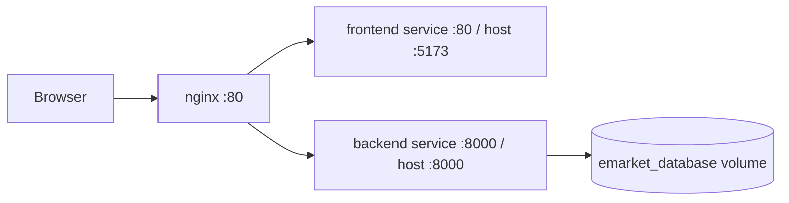

- `frontend` servisi React build çıktısını Nginx üzerinden sunar.
- `backend` servisi FastAPI uygulamasını Uvicorn ile çalıştırır.
- `nginx` servisi `/api/` yollarını backend'e, diğer yolları frontend'e proxy eder.
- Backend healthcheck `/api/v1/health` endpoint'i üzerinden yapılır.
- SQLite verileri named volume ile container silinse bile korunur.

## Katkı Sağlama

Katkı yapmak için:

1. Repository'yi fork edin.
2. Yeni bir branch oluşturun.
3. Değişiklikleri küçük ve anlaşılır commitlere bölün.
4. Backend ve frontend testlerini çalıştırın.
5. Pull request açıklamasında değişikliğin kapsamını ve test sonuçlarını belirtin.

Yeni özellik eklerken mevcut API davranışını, SQLite verilerini ve testleri korumaya özen gösterin.

## Lisans

Repository kökünde henüz bir `LICENSE` dosyası bulunmamaktadır. Açık kaynak dağıtımından önce uygun bir lisans belirlenmeli ve repository'ye eklenmelidir.
